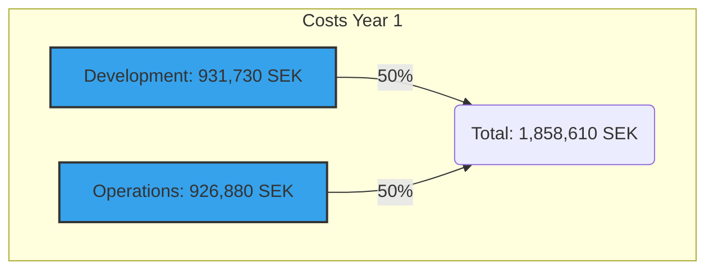
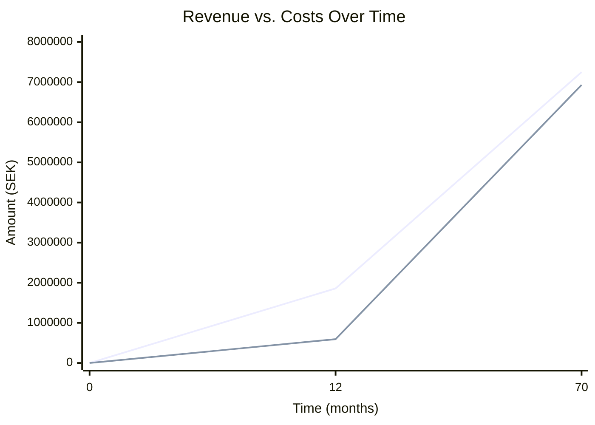
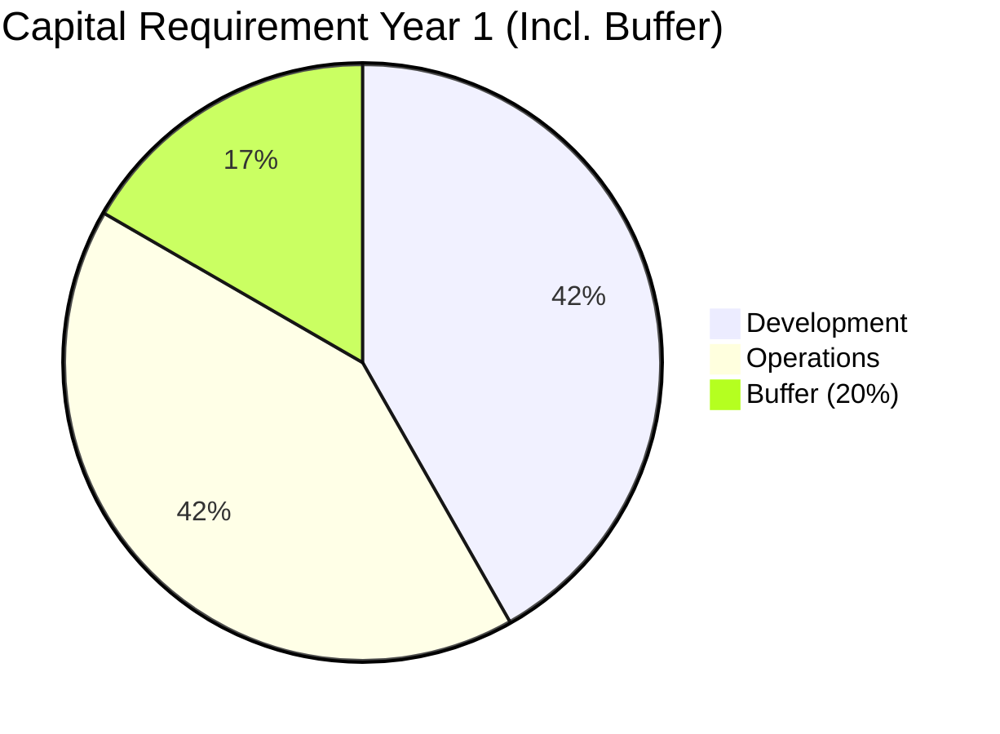
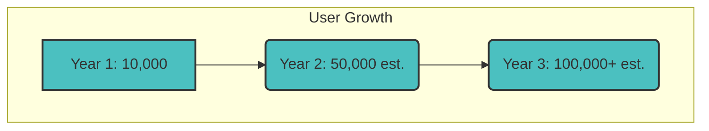
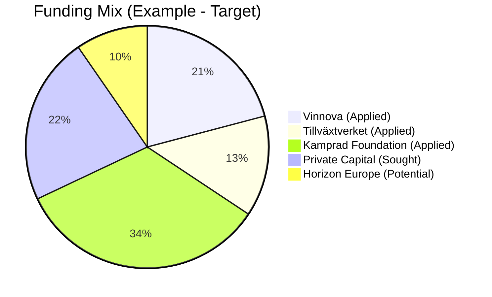
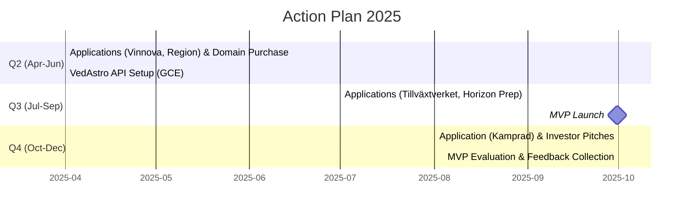

# 📊 Investor Report - Inner Journey

-   🏷️ **Version:** 1.5
-   🗓️ **Date:** 2025-03-26
-   👤 **Author:** Bo Joel Kvarnsmyr
-   ✍️ **Last revised by:** Bo Joel Kvarnsmyr

## 📝 Executive Summary

Inner Journey is an innovative and scalable healthtech platform that combines artificial intelligence (`AI`), voice interaction, and astrology. The platform's goal is to offer deeply personalized tools for self-development via a **freemium model**. Premium access, providing full access to all features, is priced at 99 SEK per month.

🚀 With a planned launch of our Minimum Viable Product (`MVP`) in September 2025, we are seeking **2.23 MSEK** in seed capital. This capital is intended to cover:

-   🛠️ **Development costs:** 931,730 SEK
-   ⚙️ **Operating costs (first year):** 926,880 SEK
-   🛡️ **Buffer:** An included buffer for unforeseen expenses.

💰 We forecast revenue of **594,000 SEK** during the first year of operation. This figure is based on an estimated user base of 10,000 individuals and a conversion rate of 10% to the premium service. With the current model, break-even is projected to occur after approximately 5.8 years. However, we see potential to shorten this timeframe through strategic optimizations.

🏦 Funding is planned through a combination of public grants (with potential to secure up to 1.78 MSEK from sources like `Vinnova` and `Horizon Europe`) and private capital. We are actively seeking **0.5–1.5 MSEK** from investors in exchange for equity shares.

Inner Journey represents a unique opportunity to invest in a globally scalable solution focused on promoting human well-being.

## 💡 Overview and Vision

Inner Journey is a digital tool developed to support **personal self-development and well-being**. By integrating advanced `AI`, astrological principles, and voice-based interactions, the platform delivers tailored insights and practical exercises directly to the user.

🌍 Our vision is to reach a global audience and actively contribute to improved mental health. This will be achieved through an accessible and easily scalable freemium platform. The project is currently in the development phase, with a planned `MVP` launch in September 2025.

For a more detailed overview of the project and its potential, you are warmly welcome to contact us.

## 💰 Financial Summary

Below is an overview of the project's key financial aspects.

### Costs 💸

The project's costs for the first year are primarily divided between development and operations:

-   **Development costs (`MVP`): 931,730 SEK**
    -   *Includes:* Three months of intensive development sprints, personnel costs, external consulting services, and the purchase of the domain name (`innerjourney.com`).
-   **Operating costs (year 1): 926,880 SEK**
    -   *Calculated to:* Initially support up to 1,000 active users per month.
-   **Total costs (year 1, excl. buffer): 1,858,610 SEK**

**Cost Distribution Year 1:**

### Revenue 📈

Our revenue model is based on a freemium strategy:

-   **Business model:** Freemium
    -   🆓 A basic version is offered free of charge.
    *   💎 The premium version provides full access to all features for **99 SEK/month**.
-   **Revenue forecast (year 1): 594,000 SEK**
    *   *Based on:* **10,000** total users and a conversion rate of **10%** to premium subscriptions.
-   **Break-even:** Approximately **70 months (5.8 years)** with the current model.
    *   *Potential:* This timeframe could potentially be reduced through price adjustments, increased conversion rates, or optimized marketing.

**Revenue vs. Costs Over Time (Forecast):**

### Capital Requirement 🏦

To ensure a successful launch and operation during the first year, including a safety margin, the capital requirement is as follows:

-   **Total capital requirement (incl. buffer): 2,230,332 SEK**
    -   Includes a buffer of **20% (371,722 SEK)** to handle unforeseen costs.
-   **Net capital requirement (year 1, after projected revenue): 1,636,332 SEK**

**Capital Requirement Year 1 (Incl. Buffer):**

## 💻 Technical Infrastructure

Inner Journey is built on a modern, scalable, and cost-effective tech stack:

-   🔥 **Hosting & Backend:**
    -   `Firebase` is used for hosting, user authentication, and data storage (`Firestore`).
    -   A dedicated backend server (`Node.js`/`Python`, estimated cost approx. 2,000 SEK/month) handles core logic and integrations.
-   🗣️ **Voice Interaction:**
    -   `Sinch Voice API`: Used for call functionality and potentially voice-based authentication.
    -   `Dialogflow CX`: Google's platform for building advanced conversational AI agents for user interaction and profiling.
-   ✨ **Astrological Insights:**
    -   `VedAstro API`: Delivers necessary astrological data.
    -   For cost optimization, this API is hosted on our own `Google Cloud Compute Engine` (`GCE`) instance (type `e2-medium`, approx. 240 SEK/month).
-   🎨 **Frontend:**
    -   `Chakra UI`: A `React` UI library for quickly building an accessible, responsive, and aesthetically pleasing user interface.
-   ⚙️ **Domain:**
    -   The domain name `innerjourney.com` is planned for acquisition. Estimated one-time cost: **25,000 SEK**.

By self-hosting the `VedAstro API` on `GCE`, we achieve a significant monthly saving of approximately 2,760 SEK compared to using commercial external API services with similar functionality.

## 📈 Market and Potential

Inner Journey's market potential is significant, with a clearly defined target audience and strong growth opportunities:

-   🌍 **Target Audience:** Individuals globally who are actively seeking tools for self-development, personal health, mindfulness, and who have an interest in astrology as a tool for self-insight.
-   🚀 **Growth Potential:** We aim to attract **10,000 users** during the first year after launch. With a proven product and scalable infrastructure, there is potential to grow to over **100,000 users** within a **three-year period**.
-   ⭐ **Competitive Advantage:** Our unique differentiation lies in the combination of:
    -   Personalization driven by `AI`.
    -   Intuitive voice interaction.
    -   Meaningful insights from astrology.
    -   An attractive and accessible freemium model.

**User Growth Forecast (Example):**

## 💸 Funding Strategy

We plan to secure the total capital requirement of **2,230,332 SEK** through a diversified strategy combining public grants and private capital:

-   **Local and National Grants:**
    -   🇸🇪 `Vinnova`: Opportunity to apply for "Innovative Startups Stage 1", up to 465,865 SEK (corresponding to 50% of development costs).
    -   🏢 `Tillväxtverket` (Swedish Agency for Economic and Regional Growth): Potential to apply for regional business support or other relevant programs (estimated 200,000–500,000 SEK).
    -   🏦 `Familjen Kamprads Stiftelse` (The Kamprad Family Foundation): Opportunity to apply for project support within relevant areas (estimated 500,000–1,000,000 SEK).
-   **International Funds:**
    -   🇪🇺 `Horizon Europe`: Opportunity to seek funding via the EIC Accelerator or other relevant calls. Could potentially cover up to 70–80% of project costs (theoretically up to 1,784,266 SEK based on total need).
-   **Private Capital:**
    -   🤝 We are actively seeking **500,000–1,500,000 SEK** from private investors (angel investors, VCs) in exchange for equity shares in the company.

A plausible scenario is that approximately 2,015,865 SEK is initially secured through a combination of grants and early investments, while any remaining need is covered by additional funding rounds or loans if necessary.

**Example Funding Mix (Target):**

*Note: The Mermaid diagram shows an *example* of how the capital *could* be distributed among different sources.*

## 🗓️ Action Plan 2025

The following concrete milestones and activities are planned for 2025:

-   **Q2 (April–June):**
    -   ✅ Submit application to `Vinnova` (Innovative Startups).
    -   ✅ Submit potential application to `Region Gotland`.
    -   🗣️ Initiate negotiations (negotiations) for the acquisition of the domain `innerjourney.com`.
    -   🛠️ Set up and configure the proprietary instance of `VedAstro API` on `GCE`.
-   **Q3 (July–September):**
    -   ✅ Submit application to `Tillväxtverket`.
    -   📝 Prepare application for `Horizon Europe` (if a relevant call is identified).
    -   🎉 **Launch `MVP` of Inner Journey!**
-   **Q4 (October–December):**
    -   ✅ Submit application to `Familjen Kamprads Stiftelse`.
    -   🎤 Conduct active pitches and meetings with potential private investors.
    -   📊 Evaluate `MVP` launch results, collect and analyze user feedback for further development.

**Timeline Action Plan 2025:**

## 🤝 Investment Opportunity

We offer an exciting opportunity to invest in Inner Journey at an early stage and become part of our growth journey:

-   **Capital Need from Investors:** We are seeking **500,000 SEK to 1,500,000 SEK** in private capital. This capital is crucial to supplement public grants and ensure the project's progress, marketing, and continued development after the MVP launch.
-   **Offer:** Investment is made in exchange for **equity shares** in the newly formed or existing company behind Inner Journey. Specific terms and valuation are negotiable and we would be happy to discuss them further in a personal meeting.
-   **Return Potential:** ⏳➡️⚡ While current forecasts indicate break-even within approximately 5.8 years, we see a **realistic potential to shorten this time to 2–3 years**. This can be achieved through:
    -   Optimization of the pricing strategy.
    -   Improved conversion rate from free to premium users.
    -   Effective and scalable marketing efforts.
    -   Potential introduction of additional revenue streams (e.g., B2B collaborations, workshops).
-   **Why Invest?** ✨
    -   **Innovative Product:** A unique combination of `AI`, voice, and astrology within the growing healthtech market.
    -   **Scalable Model:** The freemium model and global target audience enable rapid user growth and scalability.
    -   **Strong Team:** Dedicated team with relevant expertise (although details about the team are not specified here).
    -   **Positive Impact:** The investment contributes to the development of a tool with a clear purpose – to improve people's mental well-being and self-awareness.

## ✨ Summary

Inner Journey represents a promising and innovative venture within the rapidly growing healthtech sector. We have a clear vision, a well-defined product, and a concrete plan to reach the market and achieve profitability.

With secured capital of **2,230,332 SEK**, we can fund the development of our `MVP`, execute a successful launch, and cover operating costs for the first year of operation. The expected revenue of **594,000 SEK** in year 1 lays the foundation for future expansion and sustainable growth.

We invite passionate investors who share our vision for technology as a tool for increased well-being to become part of Inner Journey's exciting journey.

📞 **Please feel free to contact us** to discuss investment opportunities in more detail, gain access to further documentation (such as a full business plan or technical specification), or to schedule a personal meeting.