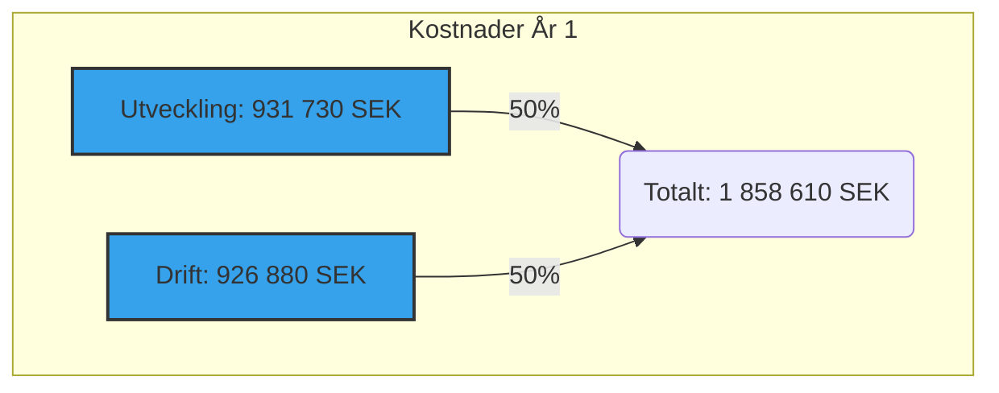
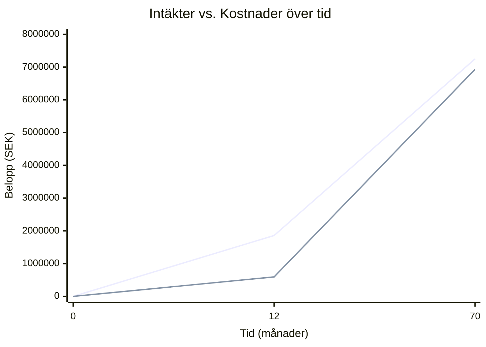
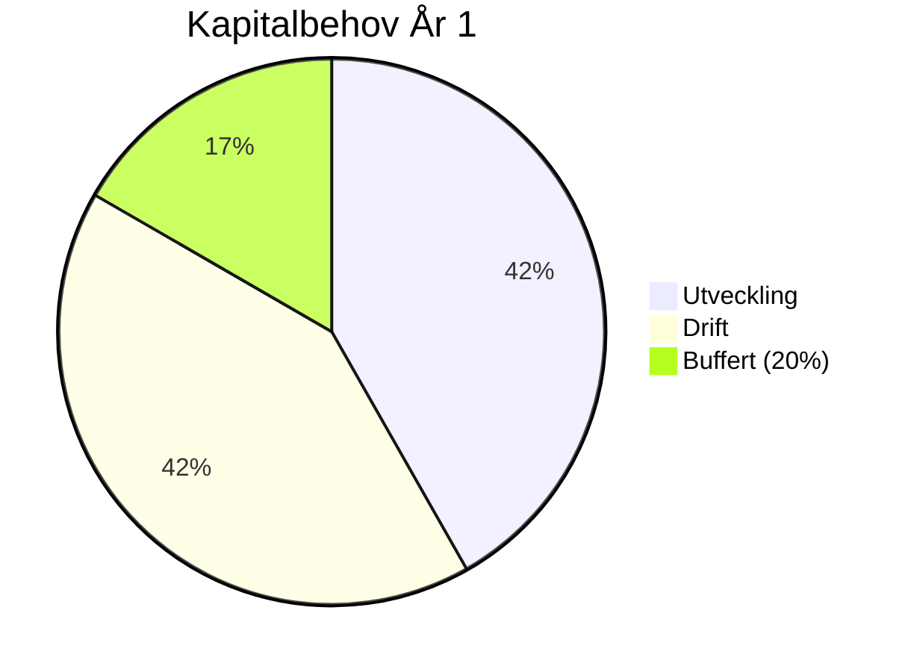
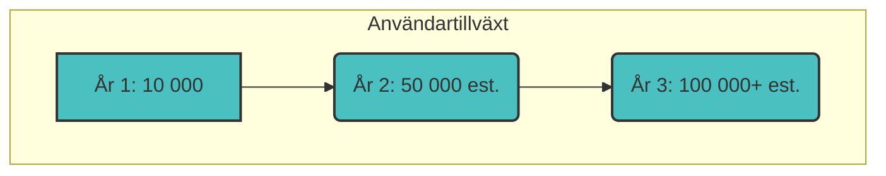
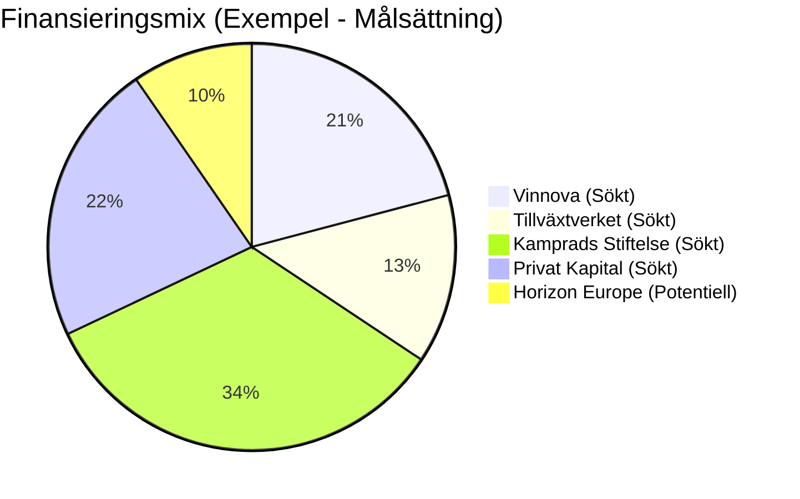
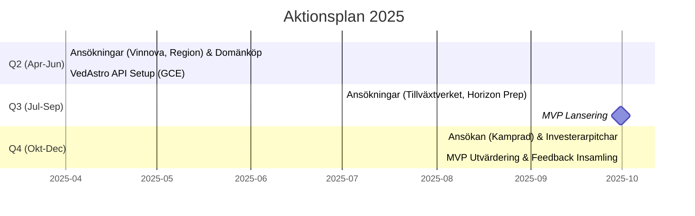

# 📊 Investerarrapport - Inner Journey

-   🏷️ **Version:** 1.5
-   🗓️ **Datum:** 2025-03-26
-   👤 **Författare:** Bo Joel Kvarnsmyr
-   ✍️ **Senast reviderad av:** Bo Joel Kvarnsmyr

## 📝 Executive Summary

Inner Journey är en innovativ och skalbar healthtech-plattform som förenar artificiell intelligens (`AI`), röstinteraktion och astrologi. Plattformens mål är att erbjuda djupt personliga verktyg för självutveckling via en **freemium-modell**. Premiumåtkomst, som ger full tillgång till alla funktioner, prissätts till 99 SEK per månad.

🚀 Med en planerad lansering av vår Minimum Viable Product (`MVP`) i september 2025, söker vi **2,23 MSEK** i startkapital. Detta kapital är avsett att täcka:

-   🛠️ **Utvecklingskostnader:** 931 730 SEK
-   ⚙️ **Driftkostnader (första året):** 926 880 SEK
-   🛡️ **Buffert:** En inkluderad buffert för oförutsedda utgifter.

💰 Vi prognostiserar intäkter på **594 000 SEK** under det första verksamhetsåret. Denna siffra baseras på en uppskattad användarbas på 10 000 individer och en konverteringsgrad på 10% till premiumtjänsten. Med nuvarande modell beräknas break-even inträffa efter cirka 5,8 år. Vi ser dock potential att förkorta denna tidsram genom strategiska optimeringar.

🏦 Finansieringen planeras ske genom en kombination av offentliga bidrag (med potential att säkra upp till 1,78 MSEK från källor som `Vinnova` och `Horizon Europe`) och privat kapital. Vi söker aktivt **0,5–1,5 MSEK** från investerare i utbyte mot ägarandelar.

Inner Journey representerar en unik möjlighet att investera i en globalt skalbar lösning inriktad på att främja mänskligt välmående.

## 💡 Översikt och Vision

Inner Journey är ett digitalt verktyg framtaget för att stödja **personlig självutveckling och välmående**. Genom att integrera avancerad `AI`, astrologiska principer och röstbaserade interaktioner, levererar plattformen skräddarsydda insikter och praktiska övningar direkt till användaren.

🌍 Vår vision är att nå en global publik och aktivt bidra till förbättrad mental hälsa. Detta ska uppnås genom en tillgänglig och lättskalad freemium-plattform. Projektet är för närvarande i utvecklingsfasen, med en planerad `MVP`-lansering i september 2025.

För en mer detaljerad genomgång av projektet och dess potential är ni varmt välkomna att kontakta oss.

## 💰 Ekonomisk Sammanfattning

Nedan följer en översikt av projektets centrala ekonomiska aspekter.

### Kostnader 💸

Projektets kostnader för det första året delas huvudsakligen mellan utveckling och drift:

-   **Utvecklingskostnader (`MVP`): 931 730 SEK**
    -   *Inkluderar:* Tre månaders intensiva utvecklingssprintar, personalkostnader, externa konsulttjänster och inköp av domännamn (`innerjourney.com`).
-   **Driftkostnader (år 1): 926 880 SEK**
    -   *Beräknat för:* Att stödja upp till 1 000 aktiva användare per månad initialt.
-   **Totala kostnader (år 1, exkl. buffert): 1 858 610 SEK**

**Kostnadsfördelning År 1:**

### Intäkter 📈

Vår intäktsmodell är baserad på en freemium-strategi:

-   **Affärsmodell:** Freemium
    -   🆓 En grundläggande version erbjuds kostnadsfritt.
    *   💎 Premiumversionen ger full tillgång till alla funktioner för **99 SEK/månad**.
-   **Intäktsprognos (år 1): 594 000 SEK**
    *   *Baserat på:* **10 000** totala användare och en konverteringsgrad på **10%** till premiumabonnemang.
-   **Break-even:** Cirka **70 månader (5,8 år)** med nuvarande modell.
    *   *Potential:* Denna tid kan potentiellt reduceras genom prisjusteringar, ökad konverteringsgrad eller optimerad marknadsföring.

**Intäkter vs. Kostnader över tid (Prognos):**

### Kapitalbehov 🏦

För att säkerställa en framgångsrik lansering och drift under det första året, inklusive en säkerhetsmarginal, ser kapitalbehovet ut som följer:

-   **Totalt kapitalbehov (inkl. buffert): 2 230 332 SEK**
    -   Inkluderar en buffert på **20% (371 722 SEK)** för att hantera oförutsedda kostnader.
-   **Nettokapitalbehov (år 1, efter prognostiserade intäkter): 1 636 332 SEK**

**Kapitalbehov År 1 (Inkl. Buffert):**

## 💻 Teknisk Infrastruktur

Inner Journey bygger på en modern, skalbar och kostnadseffektiv teknisk stack:

-   🔥 **Hosting & Backend:**
    -   `Firebase` används för hosting, användarautentisering och datalagring (`Firestore`).
    -   En dedikerad backend-server (`Node.js`/`Python`, uppskattad kostnad ca 2 000 SEK/månad) hanterar kärnlogik och integrationer.
-   🗣️ **Röstinteraktion:**
    -   `Sinch Voice API`: Används för samtalsfunktionalitet och potentiellt röstbaserad autentisering.
    -   `Dialogflow CX`: Googles plattform för att bygga avancerade konversations-AI-agenter för användarinteraktion och profilering.
-   ✨ **Astrologiska Insikter:**
    -   `VedAstro API`: Levererar nödvändig astrologisk data.
    -   För kostnadsoptimering hostas detta API på en egen `Google Cloud Compute Engine` (`GCE`) instans (typ `e2-medium`, ca 240 SEK/månad).
-   🎨 **Frontend:**
    -   `Chakra UI`: Ett `React` UI-bibliotek för att snabbt bygga ett tillgängligt, responsivt och estetiskt tilltalande användargränssnitt.
-   ⚙️ **Domän:**
    -   Domännamnet `innerjourney.com` planeras att förvärvas. Uppskattad engångskostnad: **25 000 SEK**.

Genom att själva hosta `VedAstro API` på `GCE` uppnår vi en signifikant månatlig besparing på cirka 2 760 SEK jämfört med att använda kommersiella externa API-tjänster med liknande funktionalitet.

## 📈 Marknad och Potential

Inner Journeys marknadspotential är betydande, med en tydligt definierad målgrupp och starka tillväxtmöjligheter:

-   🌍 **Målgrupp:** Individer globalt som aktivt söker verktyg för självutveckling, personlig hälsa, mindfulness och som har ett intresse för astrologi som ett verktyg för självinsikt.
-   🚀 **Tillväxtpotential:** Vi siktar på att attrahera **10 000 användare** under det första året efter lansering. Med en bevisad produkt och skalbar infrastruktur finns potential att växa till över **100 000 användare** inom en **treårsperiod**.
-   ⭐ **Konkurrensfördel:** Vår unika differentiering ligger i kombinationen av:
    -   Personlig anpassning driven av `AI`.
    -   Intuitiv röstinteraktion.
    -   Meningsfulla insikter från astrologi.
    -   En attraktiv och tillgänglig freemium-modell.

**Användartillväxtprognos (Exempel):**

## 💸 Finansieringsstrategi

Vi planerar att säkra det totala kapitalbehovet på **2 230 332 SEK** genom en diversifierad strategi som kombinerar offentliga bidrag och privat kapital:

-   **Lokala och Nationella Bidrag:**
    -   🇸🇪 `Vinnova`: Möjlighet att ansöka om "Innovativa Startups Steg 1", upp till 465 865 SEK (motsvarande 50% av utvecklingskostnaderna).
    -   🏢 `Tillväxtverket`: Potential att söka regionala företagsstöd eller andra relevanta program (uppskattningsvis 200 000–500 000 SEK).
    -   🏦 `Familjen Kamprads Stiftelse`: Möjlighet att ansöka om projektstöd inom relevanta områden (uppskattningsvis 500 000–1 000 000 SEK).
-   **Internationella Fonder:**
    -   🇪🇺 `Horizon Europe`: Möjlighet att söka finansiering via EIC Accelerator eller andra relevanta utlysningar. Kan potentiellt täcka upp till 70–80% av projektkostnaderna (teoretiskt upp till 1 784 266 SEK baserat på totalt behov).
-   **Privat Kapital:**
    -   🤝 Vi söker aktivt **500 000–1 500 000 SEK** från privata investerare (affärsänglar, VCs) i utbyte mot ägarandelar i bolaget.

Ett tänkbart scenario är att cirka 2 015 865 SEK initialt säkras via en kombination av bidrag och tidiga investeringar, medan eventuellt återstående behov täcks genom ytterligare finansieringsrundor eller lån vid behov.

**Exempel på Finansieringsmix (Målsättning):**

*Notera: Mermaid-diagrammet visar ett *exempel* på hur kapitalet *kan* fördelas mellan olika källor.*

## 🗓️ Aktionsplan 2025

Följande konkreta milstolpar och aktiviteter är planerade för 2025:

-   **Q2 (April–Juni):**
    -   ✅ Skicka in ansökan till `Vinnova` (Innovativa Startups).
    -   ✅ Skicka in eventuell ansökan till `Region Gotland`.
    -   🗣️ Påbörja förhandlingar (`переговоры`/Negotiations) för förvärv av domänen `innerjourney.com`.
    -   🛠️ Sätta upp och konfigurera den egna instansen av `VedAstro API` på `GCE`.
-   **Q3 (Juli–September):**
    -   ✅ Skicka in ansökan till `Tillväxtverket`.
    -   📝 Förbereda ansökan för `Horizon Europe` (om relevant utlysning identifieras).
    -   🎉 **Lansera `MVP` av Inner Journey!**
-   **Q4 (Oktober–December):**
    -   ✅ Skicka in ansökan till `Familjen Kamprads Stiftelse`.
    -   🎤 Genomföra aktiva pitchar och möten med potentiella privata investerare.
    -   📊 Utvärdera `MVP`-lanseringens resultat, samla in och analysera användarfeedback för vidare utveckling.

**Tidslinje Aktionsplan 2025:**

## 🤝 Investeringsmöjlighet

Vi erbjuder en spännande möjlighet att investera i ett tidigt skede i Inner Journey och bli en del av vår tillväxtresa:

-   **Kapitalbehov från Investerare:** Vi söker **500 000 SEK till 1 500 000 SEK** i privat kapital. Detta kapital är avgörande för att komplettera offentliga bidrag och säkerställa projektets framdrift, marknadsföring och fortsatta utveckling efter MVP-lansering.
-   **Erbjudande:** Investering sker mot **ägarandelar** i det nybildade eller befintliga bolaget bakom Inner Journey. Specifika villkor och värdering är förhandlingsbara och diskuteras gärna vidare i ett personligt möte.
-   **Avkastningspotential:** ⏳➡️⚡ Medan nuvarande prognoser indikerar break-even inom cirka 5,8 år, ser vi en **realistisk potential att förkorta denna tid till 2–3 år**. Detta kan uppnås genom:
    -   Optimering av prissättningsstrategin.
    -   Förbättrad konverteringsgrad från gratis till premium.
    -   Effektiva och skalbara marknadsföringsinsatser.
    -   Potentiell introduktion av ytterligare intäktsströmmar (t.ex. B2B-samarbeten, workshops).
-   **Varför Investera?** ✨
    -   **Innovativ Produkt:** En unik kombination av `AI`, röst och astrologi inom den växande healthtech-marknaden.
    -   **Skalbar Modell:** Freemium-modellen och den globala målgruppen möjliggör snabb användartillväxt och skalbarhet.
    -   **Starkt Team:** Engagerat team med relevant kompetens (även om detaljer om teamet inte specificeras här).
    -   **Positiv Impact:** Investeringen bidrar till utvecklingen av ett verktyg med ett tydligt syfte – att förbättra människors mentala välmående och självinsikt.

## ✨ Sammanfattning

Inner Journey representerar en lovande och innovativ satsning inom den snabbt växande healthtech-sektorn. Vi har en tydlig vision, en väldefinierad produkt och en konkret plan för att nå marknaden och uppnå lönsamhet.

Med ett säkrat kapital på **2 230 332 SEK** kan vi finansiera utvecklingen av vår `MVP`, genomföra en framgångsrik lansering och täcka driftkostnaderna för det första verksamhetsåret. De förväntade intäkterna på **594 000 SEK** under år 1 lägger grunden för framtida expansion och hållbar tillväxt.

Vi bjuder in passionerade investerare som delar vår vision för teknologi som ett verktyg för ökat välmående att bli en del av Inner Journeys spännande resa.

📞 **Kontakta oss gärna** för att diskutera investeringsmöjligheter mer i detalj, få tillgång till ytterligare dokumentation (som en fullständig affärsplan eller teknisk specifikation) eller för att boka ett personligt möte.